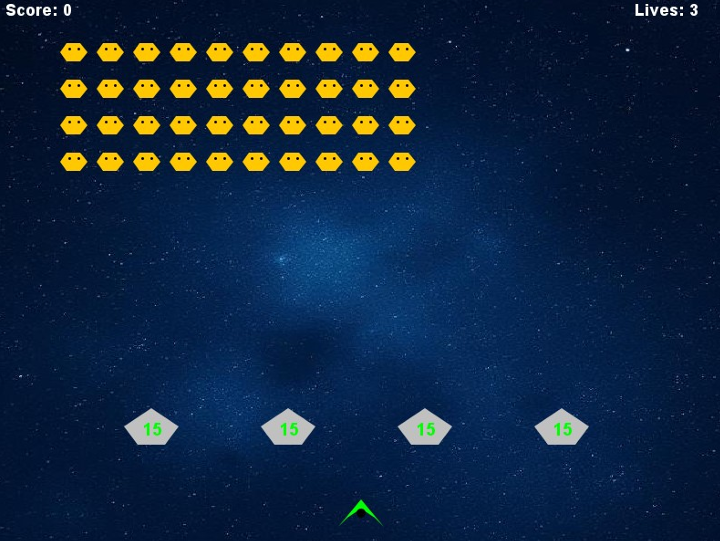

# Space Invaders (Java) 🛸

Moja obiektowa implementacja gry Space Invaders. Jest to mój trzeci duży projekt akademicki (3. semestr), w którym skupiłem się na wykorzystaniu paradygmatów Programowania Obiektowego (OOP). Gra została napisana w czystej Javie, a za interfejs graficzny i pętlę gry odpowiadają standardowe biblioteki Java Swing oraz AWT.

## 🚀 Architektura i Funkcjonalności
Projekt został podzielony na odrębne klasy reprezentujące byty w grze (`Player`, `Enemy`, `Bunker`, `Bullet`), co znacznie zwiększa czytelność i skalowalność kodu.

**Główne mechaniki:**
* Płynne poruszanie statkiem i strzelanie.
* Generowanie fal przeciwników, którzy również potrafią oddawać strzały.
* System "Bunkrów" (osłon) z własnymi punktami wytrzymałości, które niszczeją pod ostrzałem.
* System zapisu najlepszego wyniku (High Score) do zewnętrznego pliku tekstowego `highscore.txt`.
* Obsługa multimediów: podkład muzyczny z możliwością wyciszenia oraz graficzne tło.
* Funkcja aktywnej pauzy.

## 🛠️ Wymagania i Uruchomienie
Projekt nie używa zewnętrznych silników, opiera się na standardowej bibliotece Javy. Do działania wymaga:
1. Zainstalowanego środowiska **Java (JDK)**.
2. Odpowiedniej struktury pakietów (kod znajduje się w pakiecie `spaceinvaders`).
3. Plików zasobów: `background_image.png` oraz `background_music.wav` umieszczonych w ścieżce odczytu (np. folder `src` lub folder główny kompilacji).

## ⌨️ Sterowanie
* **Strzałka w lewo** - Ruch statkiem w lewo
* **Strzałka w prawo** - Ruch statkiem w prawo
* **Spacja** - Strzał
* **P** - Pauza / Wznowienie gry
* **M** - Wyciszenie / Włączenie muzyki
* **R** - Restart (po przegranej)

## 📸 Zrzuty ekranu

*Rozgrywka i ekran gry*

